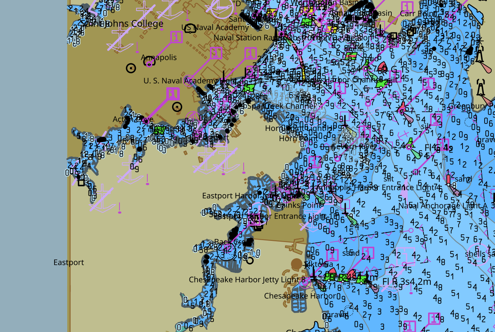

# tile57 OpenCPN plugin

An OpenCPN plugin that draws S-57/S-101 electronic navigational charts using
[tile57](https://github.com/beetlebugorg/tile57)'s live S-52 portrayal, rendered as
vector geometry on the GPU.

📖 **[Documentation](https://beetlebugorg.github.io/tile57-opencpn-plugin/)** —
building, getting started, architecture, and rendering internals.

> [!WARNING]
> **Experimental — not for navigation.** This plugin and the tile57 engine behind it
> are coded almost entirely with AI (Claude) and human-reviewed — an experiment in
> implementing a large, complex specification, not a certified or tested navigation
> product. The plugin marks its output accordingly. Do not rely on it for real-world
> navigation.



## How it works

The plugin installs a **first-class GL vector chart** (`ChartTile57`, a
`PlugInChartBaseExtended`) — not an overlay. OpenCPN discovers a tile57 chart by file
mask, adds it to the chart database, and drives it like any native chart: chart bar,
quilting, and scale transitions included. OpenCPN owns the draw order.

When OpenCPN renders the chart, the plugin follows the MapLibre "bake once, compose on
demand" model:

1. it converts OpenCPN's `PlugIn_ViewPort` into a tile57 camera (centre + a continuous
   web-mercator zoom);
2. for each visible tile, it runs tile57's S-52 portrayal once
   (`tile57_chart_tile_surface`), tessellates the resolved primitives to GPU buffers,
   and **caches** them keyed by `(z, x, y)` (LRU, budgeted so a cold view fills in
   progressively rather than freezing);
3. it composes the view from the cached tiles as a GPU transform — so panning and
   zooming reuse geometry instead of re-portraying;
4. labels are portrayed once for the whole view with a single declutter grid (and
   cached the same way) so text doesn't clash at tile seams.

ENC cells are baked to `*.pmtiles` bundles up front (via the plugin's Build Charts
dialog or the `tile57` CLI); OpenCPN then loads those bundles like any chart directory.
See the [architecture docs](https://beetlebugorg.github.io/tile57-opencpn-plugin/architecture)
for the full picture.

## Layout

```
src/tile57_pi.cpp        OpenCPN plugin entry (create_pi / plugin class); registers the chart + dialogs
src/tile57_chart.*       ChartTile57Pmtiles (PlugInChartBaseExtended) — opens a baked *.pmtiles bundle
src/chart_renderer.*     tiled portray -> tessellate -> cache -> compose on the GPU
src/build_charts.*       Build Charts dialog: bulk-bake an ENC root to *.pmtiles
src/gl.h                 GL headers (GLEW) + GLSL version prologue
third_party/earcut.hpp   polygon tessellation (Mapbox earcut, ISC)
opencpn-libs/            OpenCPN plugin API (git submodule; api-18 -> ocpn::api)
```

## Quick build

Requires a C++17 compiler, CMake ≥ 3.16, wxWidgets (with `gl`), OpenGL and GLEW, plus
**tile57** built as a static library. Clone with submodules, build tile57, then build
the plugin:

```sh
git clone --recursive https://github.com/beetlebugorg/tile57-opencpn-plugin.git

# build the tile57 engine (needs Zig 0.16; sibling directory by default)
git clone --recursive https://github.com/beetlebugorg/tile57.git
( cd tile57 && zig build -Doptimize=ReleaseFast )

# build the plugin
cmake -S tile57-opencpn-plugin -B build -DTILE57_DIR=$PWD/tile57
cmake --build build -j
```

### Windows

OpenCPN for Windows is a **32-bit** application, and a plugin has to match the process
it is loaded into — so tile57 and the plugin are both built x86. There is no system
package for wxWidgets/GLEW, so the build reuses the prebuilt 32-bit copies that
OpenCPN's own Windows build caches; get them by cloning OpenCPN alongside this repo and
running `buildwin\win_deps.bat` once. CMake then finds wx, GLEW and tile57 on its own
(override with `-DOCPN_SRC_DIR=`, `-DTILE57_DIR=`, `-DwxWidgets_ROOT_DIR=` if your
layout differs).

```bat
git clone --recursive https://github.com/beetlebugorg/tile57-opencpn-plugin.git
git clone --recursive https://github.com/OpenCPN/OpenCPN.git
cd OpenCPN\buildwin && win_deps.bat && cd ..\..

:: build the tile57 engine for the 32-bit MSVC ABI (Zig defaults to the 64-bit host,
:: and a 64-bit or gnu-ABI tile57.lib fails the link inside compiler_rt.obj)
git clone --recursive https://github.com/beetlebugorg/tile57.git
cd tile57 && zig build -Doptimize=ReleaseFast -Dtarget=x86-windows-msvc && cd ..

:: build the plugin (-A Win32 keeps it 32-bit; works from any shell, no dev prompt)
cmake -S tile57-opencpn-plugin -B build -A Win32
cmake --build build --config Release
```

That yields `build\Release\tile57_pi.dll`. Install it into the **user** plugin directory:

```bat
mkdir "%LOCALAPPDATA%\opencpn\plugins"
copy build\Release\tile57_pi.dll "%LOCALAPPDATA%\opencpn\plugins\"
```

then restart OpenCPN and enable **tile57** in Options → Plugins. It must be that
directory, not the `plugins\` folder inside OpenCPN's own install: OpenCPN skips any
plugin found there unless it is one of the five it ships with (`IsSystemPluginPath` in
`plugin_loader.cpp`), and it does so at debug log level — the plugin simply never
appears, with nothing in the log to say why. The wxWidgets and GLEW DLLs it needs at
runtime already sit in OpenCPN's install directory.

The Windows build links the CRT **statically** (`/MT`). OpenCPN ships its own
`msvcp140.dll` / `vcruntime140.dll` (14.12, from VS2017) beside `opencpn.exe` and loads
them at startup, so they are already in the process before any plugin loads — a plugin
linked against the shared CRT would run its `std::thread` / `std::mutex` code on that
2017 runtime, which MSVC does not support from a newer toolset, and it faults. Shipping
a newer DLL alongside the plugin cannot help, because the host's copy is already
loaded. Static linking is what keeps the plugin independent of whatever runtime the
host happens to bundle.

The result is `build/libtile57_pi.so` (`.dylib` on macOS, `build\Release\tile57_pi.dll`
on Windows). See the
[building guide](https://beetlebugorg.github.io/tile57-opencpn-plugin/building) for
Linux/macOS specifics (macOS needs a wxWidgets retarget + re-sign against
`OpenCPN.app`), and [getting started](https://beetlebugorg.github.io/tile57-opencpn-plugin/getting-started)
for installing and loading charts.

## Documentation

The full docs live at
**<https://beetlebugorg.github.io/tile57-opencpn-plugin/>** and are built from
`docs/` (Docusaurus) and deployed by GitHub Actions. Build them locally with:

```sh
cd docs && npm install && npm start
```

## Licensing

The plugin is GPL-2.0-or-later (matching OpenCPN's plugin ecosystem). tile57 is MIT.
Bundled third-party code is listed in `THIRD_PARTY_LICENSES.md`. Note that tile57
embeds the IHO S-101 Portrayal Catalogue (© IHO); confirm its redistribution terms
before distributing binaries.

## Limitations

OpenGL canvas only; web-mercator (no rotation/course-up yet); charts must be baked to
PMTiles (unencrypted cells). Portrayal fidelity follows tile57. See the
[known limitations](https://beetlebugorg.github.io/tile57-opencpn-plugin/limitations).
